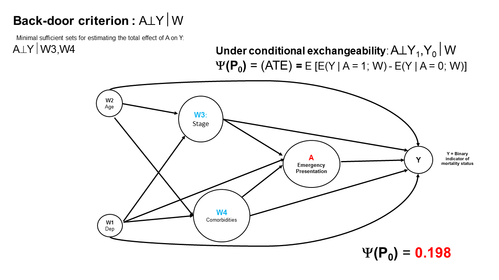
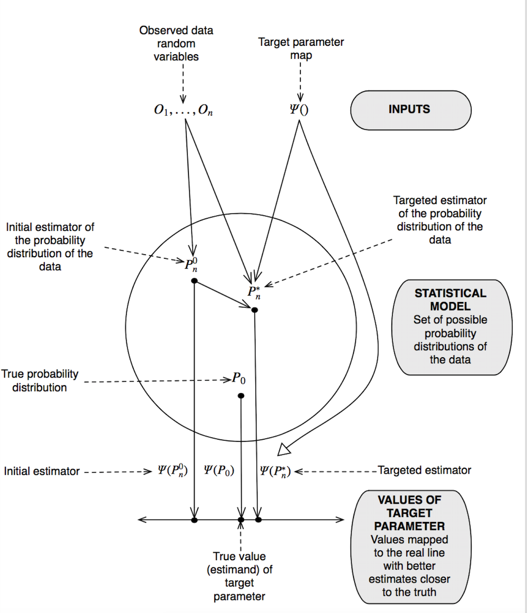
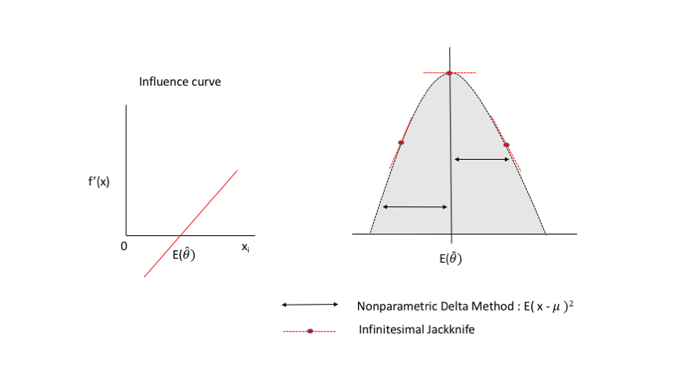
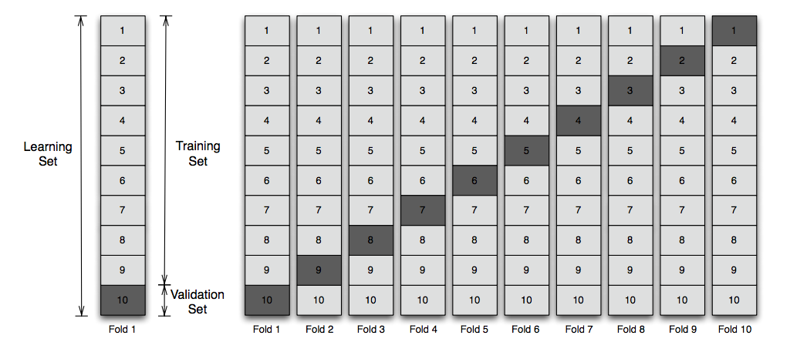
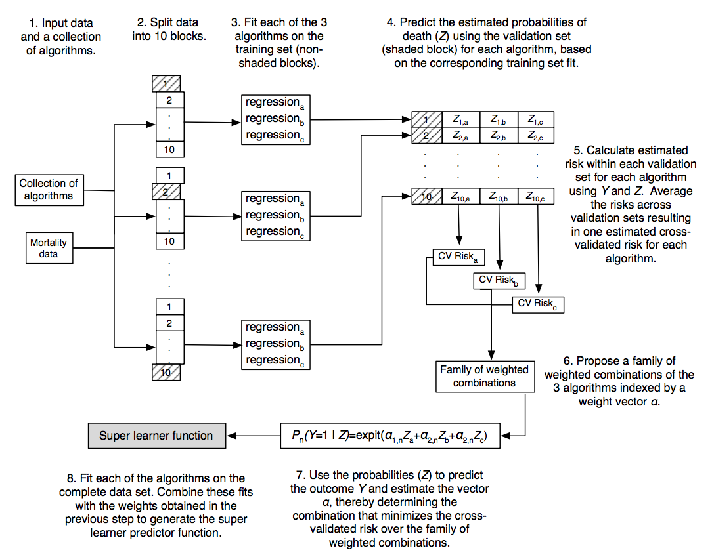

<!--BEGIN:  Set the global options and load packages-->
```{r set-global-options, echo = FALSE, message= FALSE}
knitr::opts_chunk$set(eval = TRUE, 
                      echo = TRUE, 
                      cache = FALSE,
                      include = TRUE,
                      collapse = FALSE,
                      dependson = NULL,
                      engine = "R", # Chunks will always have R code, unless noted
                      error = FALSE,
                      fig.path="Figures/",  # Set the figure options
                      fig.align = "center", 
                      fig.width = 7,
                      fig.height = 7)
#You need the suggested packages to run this notebook
#install.packages('tmle', 'SuperLearner', 'DT')
library('tmle', 'SuperLearner', 'DT')
```

#Introduction

During the last 30 years, **modern epidemiology** has been able to identify significant limitations of classic epidemiologic methods when the focus is to explain the main effect of a risk factor on a disease or outcome.  

Causal Inference based on the **Neyma-Rubin Potential Outcomes Framework** [@rubin2011], first introduced in Social Science by Donal Rubin [@rubin1974] and later in Epidemiology and Biostatistics by James Robins [@robins1986], has provided the theory and statistical methods needed to overcome recurrent problems in observational epidemiologic research, such as:

1. non-collapsibility of the odds and hazard ratios,
2. impact of paradoxical effects due to conditioning on colliders,
3. selection bias related to the vague understanding of the effect of time on exposure and outcome and,
4. effect of time-dependent confounding and mediators,
5. etc.

Causal effects are often formulated regarding comparisons of potential outcomes, as formalised by Rubin [@rubin2011]. Let A denote a binary exposure, **W** a vector of potential confounders, and Y a binary outcome. Given A, each individual has a pair of potential outcomes: the outcome when exposed, denoted $Y_{1}$, and the outcome when unexposed, $Y_{0}$. These quantities are referred to as **potential outcomes** since they are hypothetical, given that it is only possible to observe a single realisation of the outcome for an individual; we observe $Y_{1}$ only for those in the exposure group and $Y_{0}$ only for those in the unexposed group [@rubin1974]. A common causal estimand is the **Average Treatment Effect** (ATE), defined as $E[Y_{1}\, – \,Y_{0}]$.  

Classical epidemiologic methods use regression adjustment to explain the main effect of a risk factor measure on a disease or outcome. Regression adjustment control for confounding but requires making the assumption that the effect measure is constant across levels of confounders included in the model. However, in non-randomized observational studies, the effect measure is not constant across groups given the different distribution of individual characteristics at baseline.  

James Robins in 1986 demonstrated that using the **G-formula** a generalization of the **standardisation**, allows obtaining a unconfounded marginal estimation of the ATE under causal untestable assumptions, namely conditional mean independence, positivity and consistency or stable unit treatment value assignment (SUTVA) [@robins1986], [@robins2000]:      
  
#The G-Formula and ATE estimation

$$\psi(P_{0})\,=\,\sum_{w}\,\left[\sum_{y}\,P(Y=y\mid A=1,W=w)-\,\sum_{y}\,P(Y = y\mid A=0,W=w)\right]P(W=w)$$  

where,   

$$P(Y = y \mid A = a, W = w)\,=\,\frac{P(W = w, A = a, Y = y)}{\sum_{y}\,P(W = w, A = a, Y = y)}$$     
is the conditional probability distribution of Y = y, given A = a, W = w and, 

$$P(W = w)\,=\,\sum_{y,a}\,P(W = w, A = a, Y = y)$$ 

The ATE can be estimated **non-parametrically** using the G-formula. However, the **course of dimensionality** in observational studies limits its estimation. Hence, the estimation of the ATE using the G-formula relies mostly on **parametric modelling** and maximum likelihood estimation.   

The correct model specification in parametric modelling is crucial to obtain unbiased estimates of the true ATE [@rubin2011]. Alternatively, propensity score methods, introduced by Rosenbaum and Rubin [@rosenbaum1983], are also commonly used for estimation of the ATE. The propensity score is a balancing score that can be used to create statistically equivalent exposure groups to estimate the ATE via matching, weighting, or stratification [@rosenbaum1983]. 

However, very low or very high propensity scores can lead to very large weights, resulting in unstable ATE estimates with high variance and values outside the constraints of the statistical model [@lunceford2004].  

Furthermore, when analyizing observational data with a large number of variables and potentially complex relationships among them, model misspecification during estimation is of particular concern. Hence, the correct model specification in parametric modelling is crucial to obtain unbiased estimates of the true ATE [@van2011]. 

However, Mark van der Laan and Rubin [@van2006] introduced in 2006 a **double-robust** estimation procedure to **reduce bias** against misspecification. The targeted maximum likelihood estimation (**TMLE**) is a semiparametric, efficient substitution estimator [@van2011].      

#TMLE

**TMLE** allows for data-adaptive estimation while obtaining valid statistical inference based on the targeted minimum loss-based estimation and machine learning algorithms to minimise the risk of model misspecification [@van2011]. The main characteristics of **TMLE** are:      

1. **TMLE** is a general algorithm for the construction of double-robust, semiparametric, efficient substitution estimators. **TMLE** allows for data-adaptive estimation while obtaining valid statistical inference. 

2. **TMLE** implementation uses the G-computation estimand (G-formula). Briefly, the **TMLE** algorithm uses information in the estimated exposure mechanism P(A|W) to update the initial estimator of the conditional expectation of the outcome given the treatment and the set of covariates W, E$_{0}$(Y|A,W). 

3. The targeted estimates are then substituted into the parameter mapping $\Psi$. The updating step achieves a targeted bias reduction for the parameter of interest $\Psi(P_{0})$ (the true target parameter) and serves to solve the efficient score equation, namely the Influence Curve (IC). As a result, **TMLE** is a **double-robust** estimator. 

4. **TMLE** it will be consistent for $\Psi(P_{0})$ if either the conditional expectation E$_{0}$(Y|A,W) or the exposure mechanism P$_{0}$(A|W) are estimated consistently.   

5. **TMLE** will be efficient if the previous two functions are consistently estimated achieving the lowest asymptotic variance among a large class of estimators. These asymptotic properties typically translate into **lower bias and variance** in finite samples [@buh2016]. 

6. The general formula to estimate the ATE using the TMLE method:  

$$\psi TMLE,n = \Psi(Q_{n}^{*})= {\frac{1}{n}\sum_{i=1}^{n}\bar{Q}_{n}^{1}\left(1,\ W_{i}\right)-\bar{Q}_{n}^{1}\left(0,\ W_{i}\right)}.  (1)$$
7. The efficient influcence curve (IC) based on Hampel seminal paper [@hampel1974] is applied for statistical inference using TMLE:  

$$IC_{n}(O_{i})=\left(\frac{I\left(A_{i}=1\right)}{g_n\left(1\left|W_{i}\right)\right)}\ -\ \frac{I\left(A_{i}=0\right)}{g_n\left(0\left|W_{i}\right)\right)}\ \right)\left[Y_{i}-\bar{Q}_{n}^{1}\left(A_{i},W_{i}\right)\right]+\bar{Q}_{n}^{1}\left(1,\ W_{i}\right)-\bar{Q}_{n}^{1}\left(0,\ W_{i}\right) - \psi TMLE,n. (2)$$  
where the variance of the ATE:  

$$\sigma({\psi_{0}})=\sqrt{\frac{Var(IC_{n})}{n}}.  (3)$$  

8. The procedure is available with standard software such as the **tmle** package in R  [@gruber2011]. 

#Structural causal framework

##Direct Acyclic Graph (DAG)

**Figure 1**. Direct Acyclic Graph  
**Source**: Miguel Angel Luque-Fernandez  

##DAG interpretation 

The ATE is interpreted as the population risk difference in one-year mortality for lung cancer patients diagnosed via emergency presentations versus non-emergency presentations. Under causal assumptions, and compared with non-emergency presentations of lung cancer, the risk difference of one-year mortality for emergency presentations increases by approximately **20%**. 

#Causal assumptions 
To estimate the value of the true causal target parameter $\psi(P_{0})$ with a model for the true data generation process $P_{0}$ under the counterfactual framework augmented additional untestable cuasal assumptions have to be considered [@rubin2011], [@van2011]:          

##CMI or Randomization 
($Y_{0},Y_{1}\perp$A|W) or conditional mean independence (CMI) of the binary treatment effect (A) on the outcome (Y) given the set of observed covariates (W), where W = (W1,  W2, W3, … , $\text{W}_{k}$).  

##Positivity   
a ϵ A: P(A=a | W) > 0   
P(A=1|W=w) > 0 and P(A=0| W = w) > 0 for each possible w.      

##Consistency or SUTVA  
The Stable Unit Treatment Value Assumption (SUTVA) incorporates
both this idea that **units do not interfere** with one another, and also the concept that for each unit there is only a **single version of each treatment level**.      

#TMLE flow chart 

**Figure 2**. TMLE flow chart (Road map)  
**Source**: Mark van der Laan and Sherri Rose. Targeted learning: causal inference for observational and experimental dataSpringer Series in Statistics, 2011.  

#Data generation

##Simulation 

In R we create a function to generate the data. The function will have as input **number of draws** and as output the generated **observed data** (ObsData) including the counterfactuals (Y1, Y0).  

The simulated data replicationg the DAG in Figure 1:  

1. Y: mortality binary indicator (1 death, 0 alive) 
2. A: binary treatment for emergency presentation at cancer diagnosis  (1 EP, 0 NonEP)    
3. W1: Gender (1 male; 0 female)  
4. W2: Age at diagnosis (0 <65; 1 >=65)  
4. W3: Cancer TNM classification (scale from 1 to 4)  
5. W4: Comorbidities (scale from 1 to 5)  

```{r}
options(digits=4)
generateData <- function(n){
  w1 <- rbinom(n, size=1, prob=0.5)
  w2 <- rbinom(n, size=1, prob=0.65)
  w3 <- round(runif(n, min=0, max=4), digits=3)
  w4 <- round(runif(n, min=0, max=5), digits=3)
  A  <- rbinom(n, size=1, prob= plogis(-0.4 + 0.2*w2 + 0.15*w3 + 0.2*w4 + 0.15*w2*w4))
  Y  <- rbinom(n, size=1, prob= plogis(-1 + A -0.1*w1 + 0.3*w2 + 0.25*w3 + 0.2*w4 + 0.15*w2*w4))
  
  # counterfactual
  Y.1 <- rbinom(n, size=1, prob= plogis(-1 + 1 -0.1*w1 + 0.3*w2 + 0.25*w3 + 0.2*w4 + 0.15*w2*w4))
  Y.0 <- rbinom(n, size=1, prob= plogis(-1 + 0 -0.1*w1 + 0.3*w2 + 0.25*w3 + 0.2*w4 + 0.15*w2*w4))
  
  # return data.frame
  data.frame(w1, w2, w3, w4, A, Y, Y.1, Y.0)
}
set.seed(7777)
ObsData <- generateData(n=10000)
True_Psi <- mean(ObsData$Y.1-ObsData$Y.0);
cat(" True_Psi:", True_Psi)
Bias_Psi <- lm(data=ObsData, Y~ A + w1 + w2 + w3 + w4)
cat("\n")
cat("\n Naive_Biased_Psi:",summary(Bias_Psi)$coef[2, 1])
Naive_Bias <- ((summary(Bias_Psi)$coef[2, 1])-True_Psi); cat("\n Naives bias:", Naive_Bias)
Naive_Relative_Bias <- (((summary(Bias_Psi)$coef[2, 1])-True_Psi)/True_Psi)*100; cat("\n Relative Naives bias:", Naive_Relative_Bias,"%")
```

##Data visualization

```{r}
# DT table = interactive
# install.packages("DT") # install DT first
library(DT)
datatable(head(ObsData, n = nrow(ObsData)), options = list(pageLength = 5, digits = 2))
```

#TMLE simple implementation

##Step 1: $Q_{0}$(A,**W**)
Estimation of the initial probability of the outcome (Y) given the treatment (A) and the set of covariates (W), denoted as $Q_{0}$(A,**W**). To estimate $Q_{0}$(A,**W**) we can use a standard logistic regression model: 

$$\text{logit}[P(Y=1|A,W)]\,=\,\beta_{0}\,+\,\beta_{1}A\,+\,\hat{\beta_{2}^{T}}W.$$ 

Therefore, we can estimate the initial probability as follows: 

$$\bar{Q}^{0}(A,W)\,=\,\text{expit}(\hat{\beta_{0}}\,+\,\hat{\beta_{1}}A\,+\,\hat{\beta_{2}^{T}}W).$$ 

The predicted probability can be estimated using the Super-Learner library implemented in the R package “Super-Learner” [@van2007] to include any terms that are functions of A or W (e.g., polynomial terms of A and W, as well as the interaction terms of A and W, can be considered).   

Consequently, for each subject, the predicted probabilities for both potential outcomes $\bar{Q}^{0}(0,W)$ and  $\bar{Q}^{0}(1,W)$ can be estimated by setting A = 0 and A = 1 for everyone respectively:
$$\bar{Q}^{0}(0,W)\,=\,\text{expit}(\hat{\beta_{0}}\,+\,\hat{\beta_{2}^{T}}W),$$
and,  
$$\bar{Q}^{0}(1,W)\,=\,\text{expit}(\hat{\beta_{0}}\,+\,\hat{\beta_{1}}A\,+\,\hat{\beta_{2}^{T}}W).$$
**Note**: see appendix one for a short introduction to the Super-Learner and ensemble learning techniques. 

```{r}
ObsData <-subset(ObsData, select=c(w1,w2,w3,w4,A,Y))
Y  <- ObsData$Y
A  <- ObsData$A
w1 <- ObsData$w1
w2 <- ObsData$w2
w3 <- ObsData$w3
w4 <- ObsData$w4
m  <- glm(Y ~ A + w1 + w2 + w3 + w4, family=binomial, data=ObsData)
Q  <- cbind(QAW = predict(m),
            Q1W = predict(m, newdata=data.frame(A = 1, w1, w2, w3, w4)),
            Q0W = predict(m, newdata=data.frame(A = 0, w1, w2, w3, w4)))
Q0 <- as.data.frame(Q)
Y1<-Q0$Q1W 
Y0<-Q0$Q0W
QA1<-exp(Y1)/(1+exp(Y1))
QA0<-exp(Y0)/(1+exp(Y0))
#Inverse logit (probability scale)
psi <- (exp(Y1)/(1+exp(Y1)) - exp(Y0)/(1+exp(Y0)))
Psi <- mean(exp(Y1)/(1+exp(Y1)) - exp(Y0)/(1+exp(Y0))); cat("\n Q0:", Psi)
df <- round(cbind(Logit=(Q),Pr.Y1=QA1,Pr.Y0=QA0,Psi=psi), digits= 3)
```
**Visualizing** the first step:  

```{r, warning=FALSE}
datatable(head(df, n = nrow(df)), options = list(pageLength = 5, digits = 3))
```
##Step 2: $g_{0}(A,W)$
Estimation of the probability of the treatment (A) given the set of covariates (W), denoted as $g_{0}(A,W)$. We can use again a logistic regression model and to improve the prediction algorithm we can use the Super-Learner library or any other machine learning strategy:  

$$\text{logit}[P(A=1|W)]\,=\,\beta_{0}\,+\,\beta_{1}^{T}W.$$ 
Then, we estimate the predicted probability of P(A|W) = $\hat{g}(1,W)$ using:  

$$\hat{g}(1,W)\,=\,\text{expit}\,(\hat{\beta_{0}}\,+\,\hat{\beta_{1}^{T}}W).$$ 

```{r}
g <- glm(A ~ w2 + w3 + w4, family = binomial)
g1W = predict(g, type ="response");cat("\n Propensity score = g1W","\n");summary(g1W)
```

##Step 3: HAW and $\epsilon$
This step aims to find a better prediction model targeted at minimising the mean squared error (MSE) for the potential outcomes. For the ATE on step convergence is guaranteed given $\bar{Q}^{0}$ and $\hat{g}(1,W)$.  

The fluctuation parameters $(\hat{\epsilon}_{0}\,,\,\hat{\epsilon}_{1})$ are estimated using maximum likelihood procedures by setting $\text{logit}(\bar{Q^{0}}(A,W))$ as an offset in a intercept-free logistic regression with $H_{0}$ and $H_{1}$ as independent variables:      

$$\bar{Q^{1}}(A,W)\,=\,\text{expit}\left[\text{logit}\left(\bar{Q^{0}}(A, W)\right)\,+\,\hat{\epsilon_{0}}H_{0}(A,W)\,+\,\hat{\epsilon_{1}}H_{1}(A,W)\right]  (5)$$
$$\bar{Q^{1}}(0,W)\,=\,\text{expit}\left[\text{logit}\left(\bar{Q^{0}}(A,W)\right)\,+\,\hat{\epsilon_{0}}H_{0}(0,W)\right]$$

$$\bar{Q^{1}}(1,W)\,=\,\text{expit}\left[\text{logit}\left(\bar{Q^{0}}(A,W)\right)\,+\,\hat{\epsilon_{1}}H_{1}(1,W)\right]$$
Where,
$$H_{0}(A,W)\,=\,\frac{I(A=0)}{\hat{g}(0|W)}\;\text{and},\;H_{1}(A,W)\,=\,\frac{I(A=1)}{\hat{g}(1|W)}$$ are the stabilized inverse probability of treatment (A) weights (IPTW), namelly the **clever covariates** and **I** defines an indicator function (note that $\hat{g}(A|W)$ is estimted from step 2).  

```{r}
#Clever covariate and fluctuating/substitution paramteres
h <- cbind(gAW=(A/g1W -(1-A)/(1-g1W)), g1W=(1/g1W), g0W=(-1/(1-g1W)))
epsilon <- coef(glm(Y ~ -1 + h[,1] + offset(Q[,"QAW"]), family = binomial));cat("\n Epsilon:",epsilon)
df <- round(cbind(Q0,PS=(g1W),H=(h),epsilon), digits= 4)
```
**Visualizing** the 3rd step (PS = propensity score; H = IPTW or clever covarites):    

```{r, warning=FALSE}
datatable(head(df, n = nrow(df)), options = list(pageLength = 5, digits = 3))
```

##Step 4 $\bar{Q_{n}}^{*}:\text{from}\,\bar{Q_{0}}^{0}\,\text{to}\,\bar{Q_{1}}^{1}$

Afterwards, the estimated probability of the potential outcomes is updated by the substitution parameters $(\hat{\epsilon_{0}}\,,\,\hat{\epsilon_{1}})$. The substitution update is performed by setting A = 0 and A = 1 for each subject in the initial estimate probability of the potential outcomes $\bar{Q^{0}}(0,W)\,,\,\bar{Q^{0}}(1,W)$, as well as in the clever covariates $H_{0}(0,W)\;\text{and}\; H_{1}(1,W)$. 

For the $\Psi(\bar{Q_{n}}^{*})$, the updated estimate of the potential outcomes only needs one iteration $\Psi(\bar{Q_{n}}^{*})$ from $\bar{Q}^{0}(A,W)\,=>\bar{Q^{1}}(A,W)$. Therefore, model (5) targets $E[\hat{Y}_{A=0}]\;\text{and}\; E[\hat{Y}_{A=1}]$ simultaneously by including both $H_{0}(A,W)\,\text{and}\,H_{1}(A,W)$ in the model. Hence $\psi$ is finally estimated as follows:  

$$\psi TMLE,n = \Psi(Q_{n}^{*})= {\frac{1}{n}\sum_{i=1}^{n}\bar{Q}_{n}^{1}\left(1,\ W_{i}\right)-\bar{Q}_{n}^{1}\left(0,\ W_{i}\right)}.  (1)$$

```{r}
Qstar <- plogis(Q + epsilon*h)
psi <- (Qstar[,"Q1W"] - Qstar[,"Q0W"])
Psi <- mean(Qstar[,"Q1W"] - Qstar[,"Q0W"]);
cat("TMLE_Psi:", Psi)
cat("\n TMLE.SI_bias:", abs(True_Psi-Psi))
cat("\n Relative_TMLE.SI_bias:",abs(True_Psi-Psi)/True_Psi*100,"%")
```

**Visualizing** the 4th step (H = IPTW or clever covarites):  

```{r, warning=FALSE}
df <- round(cbind(Q0=(Q0),H=(h),epsilon,psi), digits= 4)
datatable(head(df, n = nrow(df)), options = list(pageLength = 5, digits = 3))
```
```{r}
cat("\n Psi first row:", plogis((0.001189*1.2399)+(2.3678))-(plogis((0.001189*-5.1681)+(1.3413))))
cat("\n TMLE_Psi:", Psi)
```

##Step 5: Inference
TMLE uses the efficient influence curve (IC) for inference (i.e., to obtain standard errors for $\psi$).   

$$IC_{n}(O_{i})\ \ =\ \left(\frac{I\left(A_{i}=1\right)}{g_n\left(1\left|W_{i}\right)\right)}\ -\ \frac{I\left(A_{i}=0\right)}{g_n\left(0\left|W_{i}\right)\right)}\ \right)\left[Y_{i}-\bar{Q}_{n}^{1}\left(A_{i},W_{i}\right)\right]+\bar{Q}_{n}^{1}\left(1,\ W_{i}\right)-\bar{Q}_{n}^{1}\left(0,\ W_{i}\right) - \psi TMLE,n. (2)$$

where the standard deviation for $\psi$ is estimated as follows:  

$$\sigma({\psi_{0}})=\sqrt{\frac{Var(IC_{n})}{n}}.  (3)$$
**Note**: see appendix two for a short introduction to the theory of the Influence Curve.   

```{r}
Q <- as.data.frame(Q)
IC <- h[,1]*(Y-Q$QAW) + Q$Q1W - Q$Q0W - Psi;summary(IC)
n <- nrow(ObsData)
varHat.IC <- var(IC)/n; varHat.IC

#Psi and 95%CI for Psi
cat("\n TMLE_Psi:", Psi)
cat("\n 95%CI:", c(Psi-1.96*sqrt(varHat.IC),  Psi+1.96*sqrt(varHat.IC)))

cat("\n TMLE.SI_bias:", abs(True_Psi-Psi))
cat("\n Relative_TMLE.SI_bias:",abs(True_Psi-Psi)/True_Psi*100,"%")
```

#TMLE vs. AIPTW
1. The advantages of **TMLE** have repeatedly been demonstrated in both simulation studies and applied analyses [@van2011]. 

2. Evidence shows that **TMLE** provides the less unbiased ATE estimate compared with other double-robust estimators [@neu2005], [@van2011] such as the combination of regression adjustment with inverse probability of treatment weighting (IPTW-RA) and the augmented inverse probability of treatment weighting (AIPTW). The **AIPTW** estimation is a two-step procedure with two equations (propensity score and mean outcome equations).  

3. To estimate the ATE using the **AIPTW** estimator one can set the estimation equation (EE) (4) equal to zero and use bootstrap to derive 95% confidence intervals (CI). However, solving the EE using the generalized method of moments (GMM), stacking both equations (propensity score and outcome), reduces the estimation and inference steps to only one. However, given that the propensity score in equation (4) can easily fall outside the range [0, 1] (if for some observations $g_{n}(1|W_{i})$ is close to 1 or 0) the **AIPTW** estimation can be unstable (near violation of the positivity assumption). **AIPTW** instability under near violation of the positivity assumption represents the price of not being a substitution estimator as **TMLE**.        

$$\psi_{0}^{AIPTW-ATE}\ \ =\ \frac{1}{n}\sum_{i=1}^{n}\left(\frac{I\left(A_{i}=1\right)}{g_n\left(1\left|W_{i}\right)\right)}\ -\ \frac{I\left(A_{i}=0\right)}{g_n\left(0\left|W_{i}\right)\right)}\ \right)\left[Y_{i}-\bar{Q}_{n}^{0}\left(A_{i},W_{i}\right)\right]+\frac{1}{n}\sum_{i=1}^{n}\bar{Q}_{n}^{0}\left(1,\ W_{i}\right)-\bar{Q}_{n}^{0}\left(0,\ W_{i}\right). (4)$$

```{r}
AIPTW <- mean((h[,1]*(Y-Q$QAW))+(Q$Q1W-Q$Q0W)); AIPTW
cat("\n AIPTW_bias:", abs(True_Psi-AIPTW))
cat("\n Relative_AIPTW_bias:",abs(True_Psi-AIPTW)/True_Psi*100,"%")
```

Compared with AIPTW, TMLE showed smaller relative bias.  

#TMLE using the Super-Learner 

With TMLE we can call the Super-Learner (SL). The SL is a R-package using V-fold cross-validation and ensembled learning (prediction using all the predictions of multiple stacked learning algorithms) techniques to improve model prediction performance [@breiman1996].  

The basic implementation of TMLE in the R-package **tmle** uses by default three algorithms:    
1. SL.glm (main terms logistic regression of A and W),    
2. SL.step (stepwise forward and backward model selection using AIC criterion, restricted to second order polynomials) and,  
3. SL.glm.interaction (a glm variant that includes second order polynomials and two by two interactions of the main terms included in the model).    

The principal interest of calling the Super-Learner is to obtain the less-unbiased estimated for $\bar Q_{n}^{0}(A,W)$ and $g_{0}(A,W)$. It is achieved by obtaining the smallest expected loss function for Y or A (binary outcomes), respectively. For instance, the negative logarithmic loss function for Y is computed as the minimizer of the expected squared error loss:   
$$\bar Q_{0}\,=\, \text{arg min}_{\bar Q}E_{0}L(O, \bar Q),$$   
where $L(O, \bar Q)$ is:
$$ (Y \,-\, \bar Q(A, W))^{2}$$
**Note**: see appendix one for a short introduction to the Super-Learner and ensemble learning techniques. 

1. **Step One**: $\bar Q_{n}^{0}(A,W)$ prediction

```{r}
#Q0
library(SuperLearner)
#Specify SuperLearner libraries
SL.library <- c("SL.glm","SL.step","SL.glm.interaction")
#Data frame with X with baseline covariates and exposure
X <- subset(ObsData, select=c(A, w1, w2, w3, w4))
n <- nrow(ObsData)
#Create data frames with A=1 and A=0
X1<-X0<-X
X1$A <-1
X0$A <-0
#Create new data by stacking X, X1, and X0
newdata <- rbind(X,X1,X0)
#Call superlearner
Qinit <- SuperLearner(Y=ObsData$Y, X=X, newX=newdata, SL.library=SL.library, family="binomial")
Qinit
#Predictions
#Pred prob of survival given A, W
QbarAW <- Qinit$SL.predict[1:n]
#Pred prob of surv for each subject given A=1 and w
Qbar1W <- Qinit$SL.predict[(n+1):(2*n)]
#Pred prob of surv for each subject given A=0 and w
Qbar0W <- Qinit$SL.predict[(2*n+1):(3*n)]
#Simple substitution estimator Psi(Q0)
PsiHat.SS <- mean(Qbar1W-Qbar0W);PsiHat.SS
```

2. **Step two**: $g_{0}(A,W)$ prediction

```{r, warning=FALSE}
#Step 2 g_0(A|W) with SuperLearner
w <- subset(ObsData, select=c(w1,w2,w3,w4))
gHatSL <- SuperLearner(Y=ObsData$A, X=w, SL.library=SL.library, family = binomial)
gHatSL;mean(gHatSL)

#Generate the pred prob of A=1 and, A=0 given covariates
gHat1W <- gHatSL$SL.predict
gHat0W <- 1-gHat1W

#Step 3: Clever covariate
HAW <- as.numeric(ObsData$A==1)/gHat1W - as.numeric(ObsData$A==0)/gHat0W;mean(HAW)
H1W <-  1/gHat1W
H0W <- -1/gHat0W
```
3. **Steps 3 and 4**: fluctuation step and substitution estimation for $\bar Q_{n}^{0}(A,W)$ to $\bar Q_{n}^{1}(A,W)$  

```{r}
#Step 4: Substitution estimaiton Q* of the ATE.
logitUpdate <- glm(ObsData$Y ~ -1 + offset(qlogis(QbarAW))+HAW, family='binomial')
eps <- logitUpdate$coef;eps
#Calculating the predicted values for each subject under each txt
QbarAW.star <- plogis(qlogis(QbarAW)+eps*HAW)
Qbar1W.star <- plogis(qlogis(Qbar1W)+eps*H1W)
Qbar0W.star <- plogis(qlogis(Qbar0W)+eps*H0W)
PsiHat.TMLE.SL <- mean(Qbar1W.star) - mean(Qbar0W.star)
cat("PsiHat.TMLE.SL:", PsiHat.TMLE.SL)
cat("\n PsiHat.TMLE.SL_bias:", abs(True_Psi-PsiHat.TMLE.SL))
cat("\n Relative_PsiHat.TMLE.SL_bias:",abs(True_Psi-PsiHat.TMLE.SL)/True_Psi*100,"%")
```

#R-TMLE

Using the R-package **tmle**.  

The basic implementation of TMLE in the R-package **tmle** uses by default three algorithms:      
1. SL.glm (main terms logistic regression of A and W),    
2. SL.step (stepwise forward and backward model selection using AIC criterion, restricted to second order polynomials) and,  
3. SL.glm.interaction (a glm variant that includes second order polynomials and two by two interactions of the main terms included in the model).    

```{r}
library(tmle)
w <- subset(ObsData, select=c(w1,w2,w3,w4))
tmle <- tmle(Y, A, W=w)
cat("TMLER_Psi:", tmle$estimates[[2]][[1]],";","95%CI(", tmle$estimates[[2]][[3]],")")
cat("\n TMLE_bias:", abs(True_Psi-tmle$estimates[[2]][[1]]))
cat("\n Relative_TMLE_bias:",abs(True_Psi-tmle$estimates[[2]][[1]])/True_Psi*100,"%")
```

#R-TMLE improving prediction

In addition to the default algorithms implemented in the R-tmle package, we can improve our estimation calling more efficient machine learing algorithms, such as generalized additive models, the Random Forest and, Recursive Partitioning and Regression Trees:    

```{r}
SL.TMLER.Psi <- tmle(Y=Y, A=A, W=w, family="binomial", 
    Q.SL.library = c("SL.glm", "SL.step", "SL.glm.interaction", "SL.gam", "SL.randomForest", "SL.rpart"),
    g.SL.library = c("SL.glm", "SL.step", "SL.glm.interaction", "SL.gam", "SL.randomForest", "SL.rpart"))

cat("SL.TMLER.Psi:", SL.TMLER.Psi$estimates[[2]][[1]],";","95%CI(", SL.TMLER.Psi$estimates[[2]][[3]],")")
cat("\n SL.TMLER.Psi_bias:", abs(True_Psi-SL.TMLER.Psi$estimates[[2]][[1]]))
cat("\n Relative_SL.TMLER.Psi_bias:",abs(True_Psi-SL.TMLER.Psi$estimates[[2]][[1]])/True_Psi*100,"%")
```

#Conclusions
We have demonstrated:  

1. **TMLE excels** the AIPTW estimator and,    
2. TMLE **best performance** is obtained when calling more advanced **Super-Learner** algorithms.     
 
# Appendix One
Efron in 1982 showed that the empirical **Influence Curve** estimate of standar error is the same as the one obtained using the **infinitesimal jackknife** and the **nonparametric deltha method** [@efron1982].  

1. The Delat Method uses the first order of the Taylor series expansion: 
$$f(x) \approx f(x)\,-\,f(\mu)\,+\,(x\,-\,\mu)f'(\mu);$$   
where $f'(\mu)$ is the derivative of the function with respect to X evaluated at the mean of X. Therefore, squaring both terms, the variance is approximately estimate as follwos:
$$\text{E}[f(x)-f(\mu)]^{2}\approx \text{E}(x\,-\,\mu)^{2}\,\times\,[f'(\mu)]^{2};$$
The left-hand side of the above equation is approximately the variance of $f(x)$ and applied to the empirical distribution of X, the sample estimate of variance for X replaces:
$$\text{E}(x_{i}\,-\,\mu)^{2}.$$
The infinitesimal jackknife estimate of the standard error is defined as follows:
$$SD_{ij}(\theta_{e})\,=\,\left(\frac{\sum_{i=1}^{n}U_{i}^{2}}{n^{2}}\right)^{1/2};$$
where $\theta_{e}$ is the estimate of the parameter $\theta$ and $U_{i}$ is a **directional derivative** in the direction of the *i*th coordinate centered at the mean of the empirical distribution function.


**Figure 3**. Estimate of the $\psi$ Standard Error using the efficient Influence Curve.  
**Image credit**: Miguel Angel Luque-Fernandez. 

#Appendix Two
With TMLE we can call the R-package **Super-Learner (SL)**. The *SL* uses **cross-validation** and **ensembled learning** (using all the predictions of multiple stacked learning algorithms) techniques to improve model prediction performance [@breiman1996].  

The **SL** algorithm provides a system based on V-fold cross-validation [@efron1983] (10-folds) to combine adaptively multiple algorithms into an improved estimator, and returns a function than can be used for prediction in new datasets.  


**Figure 4**: 10-fold cross-validation algorithm.  
**Source**: Sherri Rose in Esembles in Public Health and Healt Policy. May 4, 2016.  
The basic implementation of TMLE in the R-package **tmle** uses by default three algorithms:  
1. SL.glm (main terms logistic regression of A and W),    
2. SL.step (stepwise forward and backward model selection using AIC criterion,   restricted to second order polynomials) and,  
3. SL.glm.interaction (a glm variant that includes second order polynomials and two by two interactions of the main terms included in the model).    

The principal interest of calling the Super-Learner is to obtain the less-unbiased estimated for $\bar Q_{n}^{0}(A,W)$ and $g_{0}(A,W)$. It is achieved by obtaining the smallest expected loss function for Y or A (binary outcomes), respectively. For instance, the negative logarithmic loss function for Y is computed as the minimizer of the expected squared error loss:   
$$\bar Q_{0}\,=\, \text{arg min}_{\bar Q}E_{0}L(O, \bar Q),$$   
where $L(O, \bar Q)$ is:
$$ (Y \,-\, \bar Q(A, W))^{2}$$
The **SL** algorithm first split the data into ten blocks and fits each of the selected algoriths on the training set (non-shaded blocks), then predicts the estimated probabilities of the outcome (Y) using the validation set (shaded block) for each algorithm, based on the corresponding training set. Afterwards, the **SL** estimates the the cross-validating risk for each algorithm averaging the risks across validation sets resulting in one estimated cross-validated risk for each algorithm. Finally, the **SL** selects the combination of Z that minimises the cross-validation risk, defined as the minimum mean square error for each of the selected algorithms using Y and Z. A weighted combination of the algorithms (ensemble learning) in Z is then used to predict the outcome (Y) (see Figure 5).  



**Figure 5**: Flow Diagram for the Super-Learner algorithm.  
**Source**: Mark van der Laan and Sherri Rose. Targeted learning: causal inference for observational and experimental dataSpringer Series in Statistics, 2011. 

#Abbreviations

TMLE: Targeted maximum likelihood estimation  
SL: Super Learner  
IPTW: Inverse probability of treatment weighting  
AIPTW: Augmented inverse probability of treatment weighting  
MSE: Mean squared error  
SE: Standard error  
EE: Estimation equations   
GMM: Generalised method of moments  
O: Observed ordered data structure  
W: Vector of covariates  
A: Binary treatment or exposure  
Y: Binary outcome  
$Y_{1}, Y_{O}$: Counterfactual outcomes with binary treatment A  
$P_{0}$: True data-generating distribution  
$\Psi(P_{0})$:True target parameter  
$\psi_{0}\,=\,\Psi(P_{0})$: True target parameter value  
$g_{0}$: Propensity score for the treatment mechanism (A)      
$g_{0}$: Estimate of $g_{0}$  
$\epsilon$: Fluctuation parameter  
$\epsilon_{n}$: Estimate of $\epsilon$
$H_{n}^{*}$: Clever covariate estimate (inverse probability of treatment weight)      
$L(O,\bar Q)$: Example of a loss function where it is a function of O and $\bar Q$   
$(Y \,-\, \bar Q(A, W))^{2}$: Expected squared error loss   
$\bar Q_{0}$: Conditional mean of outcome given parents; $E_{0}(Y|A,W)$  
$\bar Q_{n}$: Estimate of $\bar Q_{0}$  
$\bar Q_{n}^{0}$: Initial estimate of $\bar Q_{0}$    
$\bar Q_{n}^{1}$: First updated estimate of $\bar Q_{0}$   
$\bar Q_{n}^{*}$: Targeted estimate of $\bar Q_{n}^{0}$ in TMLE procedure; $\bar Q_{n}^{*}$ may equal $\bar Q_{n}^{1}$  

#Session Info 
```{r session-info, results ='markup'}
devtools::session_info()
```

#Thank you  
Thank you for participating in this tutorial.  
If you have updates or changes that you would like to make, please send <a href="https://github.com/migariane/MALF" target="_blank">me</a> a pull request.
Alternatively, if you have any questions, please e-mail me. 
You can cite this repository as:        
Luque-Fernandez MA, (2016). Taregeted Maximum Likelihood Estimation for a Binary Outcome: Tutorial and Guided Implementation. GitHub repository, http://migariane.github.io/TMLE.nb.html.    
**Miguel Angel Luque Fernandez**     
**E-mail:** *miguel-angel.luque at lshtm.ac.uk*  
**Twitter** `@WATZILEI`  

# References 
